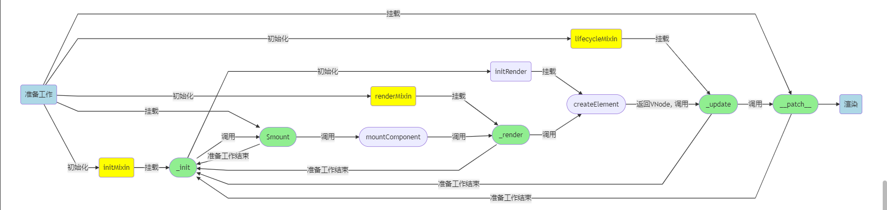

#### 前言
前一章中了解在不含组件的情况下如何创建VNode，这一节主要了解如何将生成的 VNode 通过 `_update` 渲染成真实的 DOM 并渲染出来。在 2.2 节中提到 `_update` 被调用有两种情况：一是首次渲染(在创建一个渲染Watcher时)，二是数据更新响应的时。现在只研究第一种情况。

#### _update 方法
`_update` 是通过 `lifecycleMixin` 方法添加到 Vue 原型链上。
```
import { lifecycleMixin } from './lifecycle'     // 查看方法定义
```

```javascript
export function setActiveInstance(vm: Component) {
  const prevActiveInstance = activeInstance
  activeInstance = vm
  return () => {
    activeInstance = prevActiveInstance
  }
}

Vue.prototype._update = function (vnode: VNode, hydrating?: boolean) {
  const vm: Component = this
  const prevEl = vm.$el
  const prevVnode = vm._vnode
  const restoreActiveInstance = setActiveInstance(vm)
  vm._vnode = vnode
  // Vue.prototype.__patch__ is injected in entry points
  // based on the rendering backend used.
  if (!prevVnode) {
    // initial render
    vm.$el = vm.__patch__(vm.$el, vnode, hydrating, false /* removeOnly */)
  } else {
    // updates
    vm.$el = vm.__patch__(prevVnode, vnode)
  }
  restoreActiveInstance()
  // update __vue__ reference
  if (prevEl) {
    prevEl.__vue__ = null
  }
  if (vm.$el) {
    vm.$el.__vue__ = vm
  }
  // if parent is an HOC, update its $el as well
  if (vm.$vnode && vm.$parent && vm.$vnode === vm.$parent._vnode) {
    vm.$parent.$el = vm.$el
  }
  // updated hook is called by the scheduler to ensure that children are
  // updated in a parent's updated hook.
}
```

`_update` 方法内定义的常量主要和组件视图渲染和视图更新相关。 `vm._vnode` 代表当前实例的 VNode，首次渲染时 `preVnode` 还没有值，赋值之后才有值，并将当前实例缓存在 `activeInstance`。
`_update` 方法的核心就是调用了 `__patch__` 方法，并将返回值赋值给 `vm.$el`。那么这个方法时什么地方挂载到原型链上呢？

#### \_\_patch__ 方法
在 2.2 节中提前记录，在 `runtime/index.js` 文件中，`__patch__` 在 `$mount` 之前先挂载到原型链。根据平台的差异赋值不同。在浏览器环境中，赋值 `patch` 方法。
```javascript
// install platform patch function
Vue.prototype.__patch__ = inBrowser ? patch : noop
```

#### patch 方法
```
import { patch } from './patch'       // 查看方法定义
```

```javascript
import * as nodeOps from 'web/runtime/node-ops'
import { createPatchFunction } from 'core/vdom/patch'
import baseModules from 'core/vdom/modules/index'
import platformModules from 'web/runtime/modules/index'

// the directive module should be applied last, after all
// built-in modules have been applied.
const modules = platformModules.concat(baseModules)

export const patch: Function = createPatchFunction({ nodeOps, modules })
```

通过辗转， `patch` 方法是 `createPatchFunction` 方法的返回值，该方法传入一个对象包含两个参数 `nodeOps`、`modules`。`nodeOps` 是对 DOM 操作封装之后的方法集，`modules` 是针对属性、时间、样式等等的钩子函数。

#### createPatchFunction 方法
```
import { createPatchFunction } from 'core/vdom/patch'     // 整体十分庞大，优先看返回值部分，返回值中使用到方法逐步去看
```

```javascript
export function createPatchFunction (backend) {
  // ...

  return function patch (oldVnode, vnode, hydrating, removeOnly) {
    if (isUndef(vnode)) {
      if (isDef(oldVnode)) invokeDestroyHook(oldVnode)
      return
    }

    let isInitialPatch = false
    const insertedVnodeQueue = []

    if (isUndef(oldVnode)) {
      // empty mount (likely as component), create new root element
      isInitialPatch = true
      createElm(vnode, insertedVnodeQueue)
    } else {
      const isRealElement = isDef(oldVnode.nodeType)
      if (!isRealElement && sameVnode(oldVnode, vnode)) {
        // patch existing root node
        patchVnode(oldVnode, vnode, insertedVnodeQueue, null, null, removeOnly)
      } else {
        if (isRealElement) {
          // mounting to a real element
          // check if this is server-rendered content and if we can perform
          // a successful hydration.
          if (oldVnode.nodeType === 1 && oldVnode.hasAttribute(SSR_ATTR)) {
            oldVnode.removeAttribute(SSR_ATTR)
            hydrating = true
          }
          if (isTrue(hydrating)) {
            if (hydrate(oldVnode, vnode, insertedVnodeQueue)) {
              invokeInsertHook(vnode, insertedVnodeQueue, true)
              return oldVnode
            } else if (process.env.NODE_ENV !== 'production') {
              warn(
                'The client-side rendered virtual DOM tree is not matching ' +
                'server-rendered content. This is likely caused by incorrect ' +
                'HTML markup, for example nesting block-level elements inside ' +
                '<p>, or missing <tbody>. Bailing hydration and performing ' +
                'full client-side render.'
              )
            }
          }
          // either not server-rendered, or hydration failed.
          // create an empty node and replace it
          oldVnode = emptyNodeAt(oldVnode)
        }

        // replacing existing element
        const oldElm = oldVnode.elm
        const parentElm = nodeOps.parentNode(oldElm)

        // create new node
        createElm(
          vnode,
          insertedVnodeQueue,
          // extremely rare edge case: do not insert if old element is in a
          // leaving transition. Only happens when combining transition +
          // keep-alive + HOCs. (#4590)
          oldElm._leaveCb ? null : parentElm,
          nodeOps.nextSibling(oldElm)
        )

        // update parent placeholder node element, recursively
        if (isDef(vnode.parent)) {
          let ancestor = vnode.parent
          const patchable = isPatchable(vnode)
          while (ancestor) {
            for (let i = 0; i < cbs.destroy.length; ++i) {
              cbs.destroy[i](ancestor)
            }
            ancestor.elm = vnode.elm
            if (patchable) {
              for (let i = 0; i < cbs.create.length; ++i) {
                cbs.create[i](emptyNode, ancestor)
              }
              // #6513
              // invoke insert hooks that may have been merged by create hooks.
              // e.g. for directives that uses the "inserted" hook.
              const insert = ancestor.data.hook.insert
              if (insert.merged) {
                // start at index 1 to avoid re-invoking component mounted hook
                for (let i = 1; i < insert.fns.length; i++) {
                  insert.fns[i]()
                }
              }
            } else {
              registerRef(ancestor)
            }
            ancestor = ancestor.parent
          }
        }

        // destroy old node
        if (isDef(parentElm)) {
          removeVnodes([oldVnode], 0, 0)
        } else if (isDef(oldVnode.tag)) {
          invokeDestroyHook(oldVnode)
        }
      }
    }

    invokeInsertHook(vnode, insertedVnodeQueue, isInitialPatch)
    return vnode.elm
  }
}
```

Vue 通过一系列操作最终才获得了方法，为什么这么做？这主要是缘于 Vue 目前是跨平台的，在不同平台下对 DOM 的操作时不一样。通过闭包的方法实现了对 `nodeOps` 和 `modules` 的持有，通过参数就将差异化提前固化。函数柯里化技巧运用的比较巧妙。
`createPatchFunction` 中定义了非常多的辅助函数。回到返回值函数，函数有四个参数主要看前两个。`oldVnode` 首次渲染时传入的是 `vm.$el` 是真实的 DOM， `vnode` 是 `render` 生成的 VNode。

由于传入的 `oldVnode` 是一个真实的 DOM，所以 `isRealElement` 为 true。将 `oldVnode` 通过 `emptyNodeAt` 方法转成 VNode 同时获取其的父节点。然后调用 `createElm` 方法，这个方法非常重要，并在以后经常出现。

#### createElm 方法
```javascript
function createElm (
  vnode,
  insertedVnodeQueue,
  parentElm,
  refElm,
  nested,
  ownerArray,
  index
) {
  if (isDef(vnode.elm) && isDef(ownerArray)) {
    // This vnode was used in a previous render!
    // now it's used as a new node, overwriting its elm would cause
    // potential patch errors down the road when it's used as an insertion
    // reference node. Instead, we clone the node on-demand before creating
    // associated DOM element for it.
    vnode = ownerArray[index] = cloneVNode(vnode)
  }

  vnode.isRootInsert = !nested // for transition enter check
  if (createComponent(vnode, insertedVnodeQueue, parentElm, refElm)) {
    return
  }

  const data = vnode.data
  const children = vnode.children
  const tag = vnode.tag
  if (isDef(tag)) {
    if (process.env.NODE_ENV !== 'production') {
      if (data && data.pre) {
        creatingElmInVPre++
      }
      if (isUnknownElement(vnode, creatingElmInVPre)) {
        warn(
          'Unknown custom element: <' + tag + '> - did you ' +
          'register the component correctly? For recursive components, ' +
          'make sure to provide the "name" option.',
          vnode.context
        )
      }
    }

    vnode.elm = vnode.ns
      ? nodeOps.createElementNS(vnode.ns, tag)
      : nodeOps.createElement(tag, vnode)
    setScope(vnode)

    /* istanbul ignore if */
    if (__WEEX__) {
      // in Weex, the default insertion order is parent-first.
      // List items can be optimized to use children-first insertion
      // with append="tree".
      const appendAsTree = isDef(data) && isTrue(data.appendAsTree)
      if (!appendAsTree) {
        if (isDef(data)) {
          invokeCreateHooks(vnode, insertedVnodeQueue)
        }
        insert(parentElm, vnode.elm, refElm)
      }
      createChildren(vnode, children, insertedVnodeQueue)
      if (appendAsTree) {
        if (isDef(data)) {
          invokeCreateHooks(vnode, insertedVnodeQueue)
        }
        insert(parentElm, vnode.elm, refElm)
      }
    } else {
      createChildren(vnode, children, insertedVnodeQueue)
      if (isDef(data)) {
        invokeCreateHooks(vnode, insertedVnodeQueue)
      }
      insert(parentElm, vnode.elm, refElm)
    }

    if (process.env.NODE_ENV !== 'production' && data && data.pre) {
      creatingElmInVPre--
    }
  } else if (isTrue(vnode.isComment)) {
    vnode.elm = nodeOps.createComment(vnode.text)
    insert(parentElm, vnode.elm, refElm)
  } else {
    vnode.elm = nodeOps.createTextNode(vnode.text)
    insert(parentElm, vnode.elm, refElm)
  }
}
```

`createElm` 方法不妨先看一下参数: `vnode` 没有什么说的；`insertedVnodeQueue` 内置队列，主要和声明周期相关（在 <u>3.4 节生命周期</u>中详细解释）；`parentElm` 父节点，VNode 生成的 DOM 树会插入到该节点下；`refElm` 参考节点，VNode 生成的 DOM 树插入时的节点位置参考。整个函数的作用就是将 VNode树 生成的 DOM 树并插入到它的父节点内。

方法内部，先通过`createComponent` 尝试创建子组件，<u>在 3.2 节组件的 patch</u> 中分析，目前看做 false。接着判断 VNode 是否包含 tag，如果包含，会对标签合法性进行校验，根据 tag 创建真实 DOM 节点并赋值给 `vnode.elem`。在浏览器环境下调用 `createChildren` 方法，遍历子 VNode 都生成 DOM 节点并挂载到创建的 DOM 节点内，最后将该整个节点树插入的父节点内。如果不含有标签，则可能是注释节点或者文本节点，直接创建 DOM 节点再挂载到父节点上。

#### createChildren 方法
```javascript
function createChildren (vnode, children, insertedVnodeQueue) {
  if (Array.isArray(children)) {
    if (process.env.NODE_ENV !== 'production') {
      checkDuplicateKeys(children)
    }
    for (let i = 0; i < children.length; ++i) {
      createElm(children[i], insertedVnodeQueue, vnode.elm, null, true, children, i)
    }
  } else if (isPrimitive(vnode.text)) {
    nodeOps.appendChild(vnode.elm, nodeOps.createTextNode(String(vnode.text)))
  }
}
```

诚如之前说， `createChildren` 就是通过遍历 children，对每一项进行 `createElm` 操作，如果某一项的 tag 存在且 chilren 然是数组，会再次重复该步骤，整个进行深度遍历的过程，确保每个节点最后都只能是文本节点或者是注释节点。如果 chilren 已经是文本了，那么就直接插入的父容器 DOM 节点上。
注意：在每一次递归调用 `createElm` 方法时，都会将当前 `vnode.elm` 作为父容器的 DOM 节点作为参数传入。



