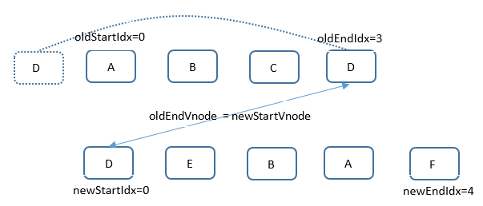
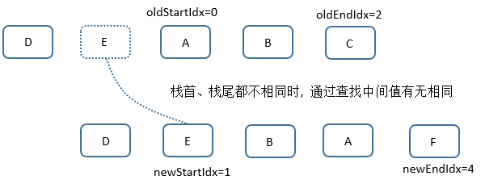
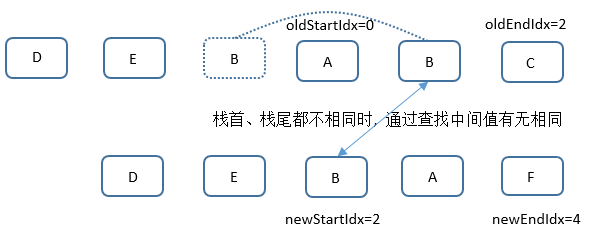
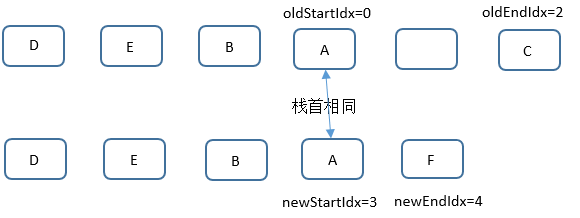
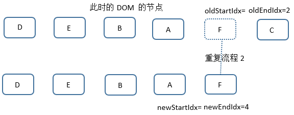

# UpdateChildren

以 [demo-4.9](https://github.com/huyoooooooo/v2-source-analysis-chase/tree/v2.5-demo-4.9) 为例，让数组通过变化 `A,B,C,D` --> `D,E,B,A,F`，尽可能多的经历不同分支。

```javascript
function updateChildren (parentElm, oldCh, newCh, insertedVnodeQueue, removeOnly) {
  let oldStartIdx = 0                 // 新旧起始位置
  let newStartIdx = 0
  let oldEndIdx = oldCh.length - 1    // 旧结束位置
  let oldStartVnode = oldCh[0]        // 旧起始节点
  let oldEndVnode = oldCh[oldEndIdx]  // 旧结束节点
  let newEndIdx = newCh.length - 1    // 新结束位置
  let newStartVnode = newCh[0]        // 新起始节点
  let newEndVnode = newCh[newEndIdx]  // 新结束节点
  let oldKeyToIdx, idxInOld, vnodeToMove, refElm

  // removeOnly is a special flag used only by <transition-group>
  // to ensure removed elements stay in correct relative positions
  // during leaving transitions
  const canMove = !removeOnly

  if (process.env.NODE_ENV !== 'production') {
    checkDuplicateKeys(newCh)
  }

  while (oldStartIdx <= oldEndIdx && newStartIdx <= newEndIdx) {
    if (isUndef(oldStartVnode)) {
      oldStartVnode = oldCh[++oldStartIdx] // Vnode has been moved left
    } else if (isUndef(oldEndVnode)) {
      oldEndVnode = oldCh[--oldEndIdx]
    } else if (sameVnode(oldStartVnode, newStartVnode)) {   // 首位比较
      patchVnode(oldStartVnode, newStartVnode, insertedVnodeQueue, newCh, newStartIdx)
      oldStartVnode = oldCh[++oldStartIdx]
      newStartVnode = newCh[++newStartIdx]
    } else if (sameVnode(oldEndVnode, newEndVnode)) {       // 尾端比较
      patchVnode(oldEndVnode, newEndVnode, insertedVnodeQueue, newCh, newEndIdx)
      oldEndVnode = oldCh[--oldEndIdx]
      newEndVnode = newCh[--newEndIdx]
    } else if (sameVnode(oldStartVnode, newEndVnode)) { // Vnode moved right 
      patchVnode(oldStartVnode, newEndVnode, insertedVnodeQueue, newCh, newEndIdx)
      canMove && nodeOps.insertBefore(parentElm, oldStartVnode.elm, nodeOps.nextSibling(oldEndVnode.elm))
      oldStartVnode = oldCh[++oldStartIdx]
      newEndVnode = newCh[--newEndIdx]
    } else if (sameVnode(oldEndVnode, newStartVnode)) { // Vnode moved left  末位移至首位
      patchVnode(oldEndVnode, newStartVnode, insertedVnodeQueue, newCh, newStartIdx)
      canMove && nodeOps.insertBefore(parentElm, oldEndVnode.elm, oldStartVnode.elm)
      oldEndVnode = oldCh[--oldEndIdx]
      newStartVnode = newCh[++newStartIdx]
    } else {
      if (isUndef(oldKeyToIdx)) oldKeyToIdx = createKeyToOldIdx(oldCh, oldStartIdx, oldEndIdx)
      idxInOld = isDef(newStartVnode.key)
        ? oldKeyToIdx[newStartVnode.key]
        : findIdxInOld(newStartVnode, oldCh, oldStartIdx, oldEndIdx)
      if (isUndef(idxInOld)) { // New element
        createElm(newStartVnode, insertedVnodeQueue, parentElm, oldStartVnode.elm, false, newCh, newStartIdx)
      } else {
        vnodeToMove = oldCh[idxInOld]
        if (sameVnode(vnodeToMove, newStartVnode)) {
          patchVnode(vnodeToMove, newStartVnode, insertedVnodeQueue, newCh, newStartIdx)
          oldCh[idxInOld] = undefined     // 中间位置节点置为 undefined，循环时自动进行下标加减一
          canMove && nodeOps.insertBefore(parentElm, vnodeToMove.elm, oldStartVnode.elm)
        } else {
          // same key but different element. treat as new element
          createElm(newStartVnode, insertedVnodeQueue, parentElm, oldStartVnode.elm, false, newCh, newStartIdx)
        }
      }
      newStartVnode = newCh[++newStartIdx]
    }
  }
  if (oldStartIdx > oldEndIdx) {
    refElm = isUndef(newCh[newEndIdx + 1]) ? null : newCh[newEndIdx + 1].elm
    addVnodes(parentElm, refElm, newCh, newStartIdx, newEndIdx, insertedVnodeQueue)
  } else if (newStartIdx > newEndIdx) {
    removeVnodes(oldCh, oldStartIdx, oldEndIdx)
  }
}
```

方法首先定义了四个变量 `oldStartIdx`、`newStartIdx`、`oldEndIdx`、`newEndIdx`, 分别获取了 oldVnode.children 和 newVnode.children 的栈首和栈尾, 两端比较：

一、第一次循环：oldEndVnode = newStartVnode, 再对其子节点做 `patchVnode` 操作(后面省略)。此时根据 newStartVnode 的位置(newStartIdx = 0) 将 DOM 插入到栈首, newStartIdx 自增一, oldEndIdx 自减一, 并获取对应 Vnode 新值。

<div align="center">
  
</div>

二、第二次循环：栈首、栈尾皆不同, 进入判断末分支。变量 `oldKeyToIdx` 存储在 oldStartIdx 和 oldEndIdx 之间的所有节点的 key 和 Idx 的键值对, 判断 newStartVnode 是否存在其中。不存在其中则直接按照通过 `createElm` 生成 vnode 对应的真实 DOM 并插入到相对节点 oldStartVnode.elm 之前。 newStartIdx 自增一, 并获取对应 Vnode 新值。

<div align="center">
  
</div>

三、第三次循环时：栈首、栈尾皆不同，但 newStartVnode.key 存在在旧节点中, 通过比较 vnodeToMove 和 newStartVnode, 此时两个节点相同, 将旧节点中的 vnode 置位 undefined(循环时，自动进行下标位置的加减一操作), 同时插入到 oldStartVnode.elm 之前。newStartIdx 自增一, 并获取对应 Vnode 新值。

<div align="center">
  
</div>

四、第四次循环时, 可以发现栈首相同, 此时只要比较比较子节点就可以, 不需要移动改节点位置。newStartIdx 自增一, oldStartIdx 自增一, 并获取对应 Vnode 新值。
<div align="center">
  
</div>

五、第五次循环此时 newStartVnode 为空，oldStartIdx 自增一, 获取下一节点内容，再次循环, 这个时候只剩最后一个节点比较不相同, 操作同流程 2, 操作结束后跳出循环(newStartIdx = 5 > newEndIdx = 4)。

<div align="center">
  
</div>

六、跳出循环后，在旧节点中存在新节点移除的 C，通过 `removeVnodes` 将其移除, 最终形成新的完全 DOM 节点.

总结: 组件更新的过程核心就是新旧 vnode diff，对新旧节点相同以及不同的情况分别做不同的处理。新旧节点不同的更新流程是创建新节点->更新父节点->删除旧节点；而新旧节点相同的更新流程是去获取它们的 children，根据不同情况做不同的更新逻辑。最复杂的情况是新旧节点相同且它们都存在子节点，那么会执行 updateChildren 逻辑。
